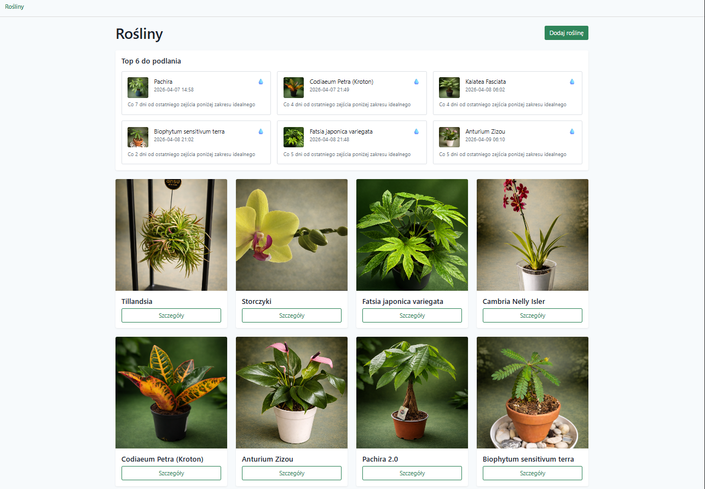
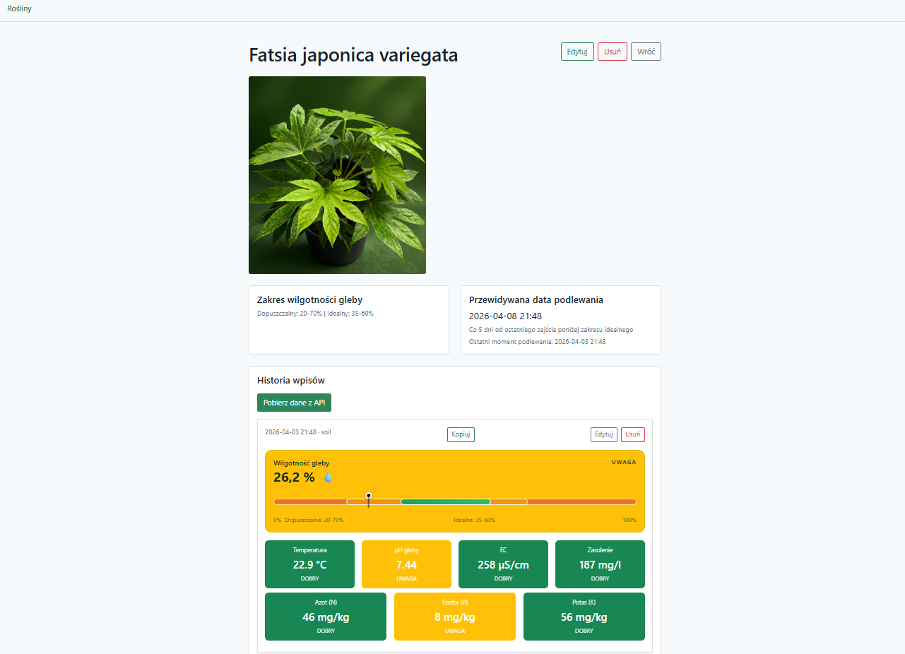

# 🌱 Plant Monitor – Laravel

Aplikacja webowa w Laravelu do monitorowania stanu roślin na podstawie danych z czujników gleby (ESP32 / HTTP JSON).
Pozwala zarządzać roślinami, zapisywać historię pomiarów, oceniać parametry kolorami oraz edytować, usuwać i kopiować wpisy.

---

## Funkcjonalności

- Dodawanie i edycja roślin (nazwa, opis, jedno zdjęcie)
- Historia wpisów (pomiary) przypisana do każdej rośliny
- Pobieranie danych z czujnika przez HTTP (JSON)
- Automatyczna ocena parametrów:
  - zielony – poprawne
  - żółty – ostrzeżenie
  - czerwony – krytyczne
- Parametry:
  - temperatura
  - wilgotność gleby
  - pH
  - EC
  - N / P / K
  - zasolenie
- Edycja wpisów (notatki, korekty)
- Usuwanie wpisów
- Kopiowanie parametrów wpisu do schowka jako tekst (jQuery)
- Frontend: Blade + Bootstrap 5
- Style SCSS kompilowane przez Vite

---

## Przykładowe dane z czujnika

Endpoint:
GET http://192.168.0.205/soil

Przykładowa odpowiedź:
```json
{
  "ok": true,
  "ts_ms": 131867,
  "temp_c": 22.9,
  "moist_pct": 8.0,
  "ec_uscm": 169,
  "ph": 7.12,
  "n_mgkg": 36,
  "p_mgkg": 5,
  "k_mgkg": 43,
  "salt_mgl": 123
}
```

---

## Wymagania

- PHP 8.2+
- Composer
- Node.js + npm
- MySQL / MariaDB
- Laravel 12

---

## Instalacja

```bash
git clone https://github.com/twoj-login/plant-monitor.git
cd plant-monitor
composer install
npm install
```

```bash
cp .env.example .env
php artisan key:generate
```

Ustaw bazę danych w `.env`:
```
DB_DATABASE=plants
DB_USERNAME=root
DB_PASSWORD=
```

Migracje:
```bash
php artisan migrate
```

Link do storage:
```bash
php artisan storage:link
```

Uruchomienie:
```bash
npm run dev
php artisan serve --port=8001
```

---

## Konfiguracja API czujnika

`.env`:
```
PLANT_API_BASE_URL=http://192.168.0.205
```

`config/services.php`:
```php
'plant_api' => [
    'base_url' => env('PLANT_API_BASE_URL'),
],
```

---

## Struktura bazy danych

### plants
- id
- name
- description
- photo_path
- timestamps

### plant_entries
- plant_id
- source
- recorded_at
- temp_c
- moist_pct
- ph
- ec_uscm
- n_mgkg
- p_mgkg
- k_mgkg
- salt_mgl
- payload (JSON)
- note
- timestamps

---

## UI

- Widok kart parametrów zamiast tabel
- Kolorowe oznaczenia stanu parametrów
- Responsywny layout (Bootstrap)
- Historia wpisów dla każdej rośliny
- Przyciski: Kopiuj, Edytuj, Usuń

---

## Rozszerzenia (pomysły)

- Zakresy parametrów per roślina
- Dashboard kondycji roślin
- Wykresy historii (Chart.js)
- Automatyczne pobieranie danych (cron)
- Eksport danych (CSV / PDF)

---

## Licencja

Projekt prywatny / edukacyjny.
Możesz dowolnie modyfikować na własne potrzeby.

## Strona główna


## Widok rośliny
